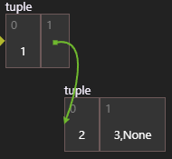
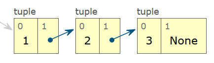

# TODOs
### Tasks die noch überprüft oder erledigt werden müssen, damit alles rund läuft

- Tests
  - Tests fürs Frontend
  - Tests fürs Backend
- Referenzen zu Objekten
  - Mit bestimmtem Code werden die Referenzpfeile nicht erstellt (HTML Elemente können nicht gefunden werden)
    - Beispiel:
      ````
      def listSum(numbers):
         if not numbers:
              return 0
          else:
              (f, rest) = numbers
              return f + listSum(rest)


      myList = (1, (2, (3, None)))
      total = listSum(myList)
      ````
  - Referenzenpfeile gehen nur in Tiefe eins, sobald Objekte in einander verschachtelt sind
    - Beispiel: Unsere Extension vs. PythonTutor
      - 
      - 
- Execeptions in Visualisierung
  - Wenn Exceptions im 
- Normaler Modus & Experten Modus (Ansichten für den User)
  - Normal Modus (Aktuelle Implementation): Zeigt alle Primitive Datentypen auf der Frame-Seite und alle Collection-Datentypen auf der Object-Seite
  - Experten Modus (Vorschlag von Herrn Wehr): Zeigt alle Werte, auch primitive Datentypen, auf der Object-Seite an
- Neue Features
  - Backendtrace importieren
    - Backendtrace ist aktuell exportierbar, aber könnte noch importierbar sein damit Traces von anderen Usern nutzbar werden
  - Weitere Programmiersprachen (Anpassungen bzw. neues Backend)
    - Java
    - C/C++
  - Benutzerdefinierte Visualisierung
    - Object-Elemente dragable machen?
    - Farben der Frames oder Object-Elemente vom User ändern lassen können?
    - etc.